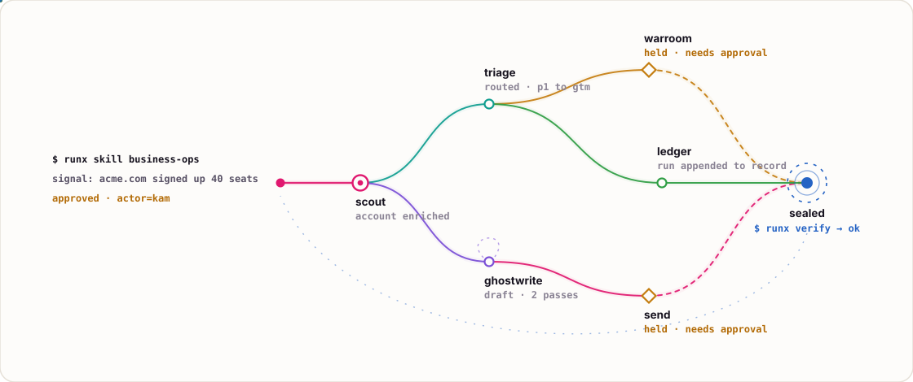

<h1 align="center">runx</h1>

<p align="center"><strong>the governed runtime for agent skills</strong></p>

<p align="center">
  <a href="LICENSE"></a>
  <a href="https://www.npmjs.com/package/@runxhq/cli"></a>
  <a href="https://github.com/runxhq/runx/actions/workflows/ci.yml"></a>
  <a href="https://runx.ai/x"></a>
  <a href="https://runx.ai/spec"></a>
</p>

---

```text
a skill is a URL.
a graph is what unfolds.
authority narrows. it does not pass through.
every act produces a receipt.
```

A skill is expertise published as a portable `SKILL.md`: an operating manual
that a human can understand and an agent can act from. Skills compose into
graphs and real work without bespoke glue code. Runx supplies the boundary:
it admits each act under explicit authority, delivers credentials without
turning them into prompt material, supervises execution, and seals the result
into a verifiable receipt.

Authority narrows through the chain, so agent work compounds without becoming
ambient trust.

## quickstart

This README has an agent-readable twin at
[runx.ai/SKILL.md](https://runx.ai/SKILL.md). Give it to an agent and the agent
learns the CLI, the catalog at [runx.ai/x](https://runx.ai/x), and how to
return receipts.

Install the CLI:

```bash
npm i -g @runxhq/cli
# or: curl -fsSL https://runx.ai/install | sh
```

Then choose how you want to run skills.

### agent path

Hand the agent a goal and let it drive the runtime:

```text
Use runx to plan and execute end-to-end business ops for my company.
Signal: acme.com signed up 40 seats yesterday.
Stop before sends, spend, merges, deploys, or publishing. Return receipts.
```

### CLI path

Run a local or catalog skill directly:

```bash
runx skill <skill-ref> [runner] -i key=value --json
```

`business-ops` is one prebuilt skill for routing a business signal end to end:

```bash
runx skill business-ops \
  -i signal="acme.com signed up 40 seats yesterday: classify the work, prepare the governed handoffs, and preserve proof" \
  --json
```

<!-- Generated by scripts/render-ops-map.mjs. Regenerate with: pnpm docs:readme-art -->
<picture>
  <source media="(prefers-color-scheme: dark)" srcset="docs/assets/ops-fanout-dark.svg">
  <source media="(prefers-color-scheme: light)" srcset="docs/assets/ops-fanout-light.svg">
  
</picture>

The graph is the core shape. One signal enters, skills chain under governed
authority, consequential lanes hold at approval gates, and every act seals into
one receipt tree that can feed the next run. The demo lanes are stand-ins; real
teams bind their own context, policies, tools, providers, and readbacks.

Some other examples:

```bash
# Docs and product engineering: build a source-bound documentation packet.
runx skill sourcey -i project=. --json

# Research and strategy: produce a governed decision brief.
runx skill deep-research \
  -i objective="Which launch risks should we resolve first?" \
  --json

# Maintainer operations: draft a useful issue response.
runx skill issue-triage \
  -i issue_url=https://github.com/runxhq/runx/issues/241 \
  -i objective="Draft the next helpful maintainer response" \
  --json
```

Build the native CLI from source when working on Runx itself:

```bash
cargo build --manifest-path crates/Cargo.toml -p runx-cli
```

On macOS 26, complete the
[Developer Tools permission prerequisite](CONTRIBUTING.md#macos-developer-tools-permission)
if this build stalls.

The npm package distributes the same Rust-owned behavior; it is not a second
runtime.

## a skill carries judgment, not runtime plumbing

`SKILL.md` is the capability's operating manual. It teaches the operator what
the work means, when to use the lane, what evidence matters, where judgment
ends, what requires approval, how failure and recovery work, and when to route
to an adjacent skill.

```markdown
---
name: hello-world
description: Echo a first Runx message through a checked-in command.
---

# Hello World

Use this package to prove the local execution and receipt path.
```

When a skill needs deterministic execution, typed inputs, graph stages,
authority, artifacts, or harness cases, it also carries an `X.yaml` execution
profile:

```yaml
skill: hello-world
version: "0.1.0"

runners:
  default:
    default: true
    type: cli-tool
    command: node
    args: [run.mjs]
    inputs:
      message:
        type: string
        required: true
```

The split is deliberate:

- `SKILL.md` owns the knowledge a human and acting agent need.
- `X.yaml` owns machine-checkable execution, authority, and evidence contracts.
- package JavaScript exists only for deterministic domain computation that the
  graph and native capability plane cannot express cleanly.
- HTTP, filesystem, process, credential, packet, and receipt mechanics belong
  to the runtime, not copied helpers inside skills.

Runx digest-binds the complete current manual into the acting context and the
resume envelope. Declared adjacent skills contribute bounded summaries until
invoked; invocation then supplies that skill's complete manual.

See [Skill to Graph](docs/skill-to-graph.md) and
[Skill Catalog](docs/skill-catalog.md).

## graphs make acts composable

Graphs let one governed act consume the typed output of another:

```yaml
name: hello-graph
steps:
  - id: first
    skill: ../hello-world
    inputs:
      message: hello from graph
  - id: second
    skill: ../hello-world
    context:
      message: first.stdout
```

The boundary is not how many model calls happened. The boundary is what must be
guaranteed:

- **Graphs** own deterministic composition, branches, fan-out, guards, and
  recovery.
- **Agent tasks** own bounded judgment under the current manual and an explicit
  tool set.
- **Native capabilities** own reusable, product-neutral runtime mechanics.
- **Deterministic modules** perform isolated JSON-to-JSON domain computation
  with no ambient filesystem, network, process, environment, clock, or random
  authority.
- **CLI tools** are intentional trusted local executables under an exact
  resolved grant. Runx controls argv, cwd, delivered environment, credentials,
  supervision, and evidence; it does not claim portable OS confinement.
- **Provider adapters** perform governed HTTP, MCP, external-adapter, outbox,
  or Connect operations under typed authority and effect contracts.

Required mutations, API calls, payments, and provider writes belong in
deterministic effect-owning lanes. An agent or graph author cannot acquire an
effect merely by naming it in prose or input data.

## authority without secret leakage

Provider-backed skills declare credential requirements in `X.yaml`. Configure
a durable local profile by piping material on stdin:

```bash
printf '%s' "$NITROSEND_API_KEY" |
  runx credential set nitrosend --profile account-one --from-stdin

runx skill ./skills/nitrosend status --profile account-one --json
```

Runx resolves explicit profiles, project bindings, global defaults, hosted
handles, and the workspace environment through one canonical path. Skill runs,
resume, inspect, managed agents, and MCP use the same readiness contract.

Receipts may include requested and granted scopes, grant references, typed
execution-boundary observations, approval decisions, provider observations,
and hashes. They must not contain raw tokens, passwords, ambient environment
dumps, or unchecked private provider bodies.

See [Credential Resolution](docs/credentials.md) and
[Security Authority Proof](docs/security-authority-proof.md).

## what a receipt proves

A Runx receipt answers the questions that matter after the agent has moved on:

| Question | Receipt surface |
| --- | --- |
| What ran? | subject, skill ref, source type, runner metadata |
| Who or what admitted it? | actor ref, grant refs, authority proof refs |
| What was allowed? | scopes, resolved grants, approval metadata |
| What happened? | acts, output artifacts, exit status, closure summary |
| Can it be checked later? | content-addressed id, canonical digest, signature, lineage |
| Did secrets leak into proof? | redaction metadata and hashed material refs |

Every governed execution passes through one invariant:

```text
admit -> resolve grant -> deliver credentials -> execute -> seal
```

Run a local verification with the explicit development-signature allowance:

```bash
runx verify --allow-local-development-signatures --json
```

Production verification requires a trusted verification key. The receipt is
not the product by itself; it is where authority, action, evidence, and future
learning meet in one verifiable object.

## demos that prove boundaries

These checked-in paths produce receipts rather than screenshots or prose-only
claims:

| Demo | What it proves | Run |
| --- | --- | --- |
| `examples/hello-world` | Native CLI skill path and sealed receipt baseline | `runx harness examples/hello-world` |
| `skills/business-ops` | One signal fans through governed lanes and preserves a graph receipt | `runx harness skills/business-ops` |
| `examples/github-mcp-hero` | Governed read succeeds and an out-of-scope write is refused | `sh examples/github-mcp-hero/run.sh` |
| `examples/http-graph` | Native governed HTTP executes against a local fixture | `sh examples/http-graph/run.sh` |
| `examples/openapi-graph` | An OpenAPI operation uses the external-adapter lane | `sh examples/openapi-graph/run.sh` |
| `examples/governed-spend/skills/overspend-refused` | Spend above authority is refused before rail execution | `runx harness examples/governed-spend/skills/overspend-refused` |

For deterministic payment dogfood without funded wallets or provider keys:

```bash
pnpm demos:check
```

See [Demos](docs/demos.md).

## publish and trust

A public skill is a standalone package: a substantive `SKILL.md`, optional
`X.yaml`, and only the files Runx can consume. Publish locally first:

```bash
runx registry publish ./skills/<your-skill>
```

Then publish to the hosted catalog when you want shared discovery:

```bash
runx login --for publish
runx registry publish ./skills/<your-skill> \
  --registry https://api.runx.ai
```

Hosted publishing reconstructs the submitted package, reruns its harness, and
stores immutable package digests. Publisher declaration alone is not trust.

See [Publishing](docs/publishing.md).

## architecture

Runx has one owner for every contract and behavior:

| Layer | Owner |
| --- | --- |
| portable wire contracts | `runx-contracts` |
| pure policy, authority, and state transitions | `runx-core` |
| package parsing and the aggregate validated package IR | `runx-parser` |
| canonical receipts, hashing, signatures, verification | `runx-receipts` |
| execution, capabilities, process supervision, adapters, effects | `runx-runtime` |
| argument parsing and presentation | `runx-cli` |
| generated language bindings and narrow extension protocols | `packages/` |
| operator knowledge and irreducible domain computation | `skills/` and product-owned packages |

The native CLI, SDKs, schemas, catalog views, exported agent shims, and docs all
consume those owners; none is a parallel parser, executor, credential loader,
authoring framework, effect registry, or provider client.

The normative contract is
[Runx System Architecture](docs/architecture/runx-system.md). Historical design
notes explain how the repository arrived here but do not override it.

## docs

| Read this | When you need |
| --- | --- |
| [getting started](docs/getting-started.md) | first skill, first receipt |
| [system architecture](docs/architecture/runx-system.md) | ownership, execution lanes, boundaries |
| [credential resolution](docs/credentials.md) | profiles, bindings, `.env`, hosted grants |
| [skill to graph](docs/skill-to-graph.md) | compose governed acts |
| [security authority proof](docs/security-authority-proof.md) | scope, credentials, grants, verification |
| [demos](docs/demos.md) | runnable proof paths |
| [publishing](docs/publishing.md) | local and hosted skill publishing |
| [skill catalog](docs/skill-catalog.md) | categories, search, first-party map |
| [reference](docs/reference.md) | CLI, crates, registry, receipts, extension protocols |
| [the spec](https://runx.ai/spec) | act model, receipt grammar, public contracts |
| [the catalog](https://runx.ai/x) | governed skills by URL |

## contributing

Setup, focused test selection, and sign-off rules are in
[CONTRIBUTING.md](CONTRIBUTING.md). Security policy:
[SECURITY.md](SECURITY.md). Runx is MIT licensed; see [LICENSE](LICENSE).

---

<p align="center"><sub>built in Rust &middot; MIT &middot; <a href="https://runx.ai">runx.ai</a></sub></p>
